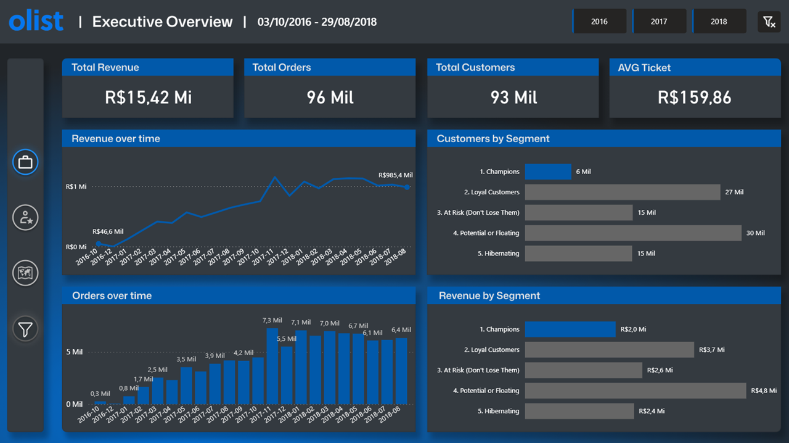

# 📊 Marketing Project: Olist E-commerce Analytics

An end-to-end Data Engineering pipeline that turns raw Brazilian e-commerce data into an
RFM (Recency, Frequency, Monetary) customer segmentation model, built on **Databricks**
with the **Medallion Architecture** and consumed in **Power BI**.

The dataset is the public [Olist Brazilian E-commerce](https://www.kaggle.com/datasets/olistbr/brazilian-ecommerce)
dataset from Kaggle, a real, anonymized record of orders placed on a Brazilian marketplace.

🔗 **[View the live dashboard](https://app.powerbi.com/view?r=eyJrIjoiNTZlOWNhMWQtNjRmMC00MTRhLTk3NWEtNjE1NGU4OTkzZWYwIiwidCI6IjY3NGM2ZGQyLWQ5YWQtNGU1ZC05YzU2LWI0MTZiOWM5YzYzOSJ9)**

---

## Pipeline Overview

The project is organized into four sequential notebooks, one per stage of the pipeline.
Each layer has a single, well-defined responsibility, and every schema, table, and column
is documented directly in the Unity Catalog for data discovery.

```
Kaggle API  →  Bronze (raw)  →  Silver (clean)  →  Gold (star schema)  →  Power BI
```

### `01` — Infrastructure Setup
Creates the three Medallion schemas (`bronze_marketing_project`, `silver_marketing_project`,
`gold_marketing_project`) inside the Unity Catalog, documents each one with a `COMMENT`, and
provisions a secure **Unity Catalog Volume** to act as the landing zone for the raw files.

### `02` — Bronze Layer (Ingestion)
Downloads the Olist dataset straight from the Kaggle API into the Volume, using credentials
stored in a **Databricks Secret Scope** (never hardcoded). It then loops through every raw CSV
and writes it as a Delta table, standardizing the table names along the way. The write uses
`overwrite` mode, so the notebook is **idempotent**, re-running it never duplicates data.

### `03` — Silver Layer (Refinement)
Turns raw Bronze tables into a clean, trustworthy business layer:

- **`silver_marketing_transactions`** — only delivered orders, with fragmented payments
  consolidated into a single value per order.
- **`silver_customer_profiles`** — customers joined to geolocation, with coordinates
  deduplicated by zip code to prevent Cartesian explosions.

Every column carries a business description in the Catalog.

### `04` — Gold Layer (Star Schema + RFM)
This is where the analytical model is built. Two decisions here are worth highlighting.

**RFM scoring.** Recency, Frequency, and Monetary metrics are aggregated per *real* customer
(`customer_unique_id`, not the per-order `customer_id`), scored into 1–5 quintiles with
`NTILE`, and labeled into actionable segments: Champions, Loyal Customers, At Risk,
Hibernating, and Potential or Floating.

**Star schema for BI.** Instead of a single flat table, the Gold layer outputs a proper
star schema:

- **`gold_orders`** — the fact table (one row per delivered order), carrying the
  `customer_unique_id` foreign key.
- **`gold_customers`** — the customer dimension (one row per person), holding the RFM scores,
  segment, and geography.

Because fact and dimension share a clean key, filters in Power BI propagate correctly across
the whole model, a segment, state, or date filter reaches every visual on the page. A flat
table could not do this: the transactional `customer_id` changes with every order, so revenue
and customer identity live at different grains and cannot be joined directly.

> **Geography resolution.** A single customer can place orders from different locations. Each
> customer is resolved to the location of their **most recent purchase**, which keeps the
> dimension at one row per person and aligns with the recency logic already at the core of RFM.

A final **sanity-check** cell validates that the fact table preserves the exact row count and
total revenue of its Silver source, proof that no data was lost or duplicated along the way.

---

## Tech Stack

| Area | Tools |
|---|---|
| Language | PySpark (Python) & Spark SQL |
| Platform | Databricks + Unity Catalog |
| Storage | Delta Lake |
| Ingestion | Kaggle API + Databricks Volumes |
| Secrets | Databricks Secret Scope |
| Visualization | Power BI (Import mode) |

---

## Engineering Highlights

- **Idempotent notebooks** — every write uses `overwrite`, so the pipeline is safe to re-run.
- **Secure credentials** — Kaggle keys live in a Secret Scope, never in the code.
- **Governed by design** — schemas, tables, and columns carry descriptions in the Unity Catalog.
- **Dimensional modeling** — a real star schema, not a flat table, so the BI model filters cleanly.
- **Validated integrity** — a built-in reconciliation check confirms the fact table matches its source.

---

## How to Navigate

| Notebook | Stage |
|---|---|
| `01_Infrastructure_Setup` | Schema and Volume creation |
| `02_Bronze_Ingestion` | Kaggle-to-Volume ingestion, raw Delta tables |
| `03_Silver_Refinement` | Cleaning, deduplication, payment consolidation |
| `04_Gold_Analytics` | Star schema (fact + dimension) and RFM segmentation |

---

## 📈 Dashboard

The Gold layer feeds a Power BI report in **Import mode**, the dataset is a static historical
snapshot (Sep 2016 – Aug 2018), so no scheduled refresh is needed. The report is organized into
three pages:

- **Executive Overview** — headline KPIs (revenue, orders, customers, average ticket) alongside
  revenue and order trends over time, and a first look at how customers and revenue split
  across the RFM segments.
- **Customer Behavior** — the deeper RFM view: a per-customer scatter of recency against
  monetary value, a segment breakdown table, the purchase-frequency distribution, and average
  ticket by segment.
- **Geo Strategy** — where the revenue is: a shape map of Brazil plus revenue by state, top
  cities, and average ticket by state.
  
> 💡 **Production Note:** Since the Olist dataset is a static historical snapshot, this project uses Power BI in Import mode without scheduled refreshes. However, in a real-world, continuous production environment, this pipeline would be fully automated. A **Databricks Workflow (Job)** would be configured to trigger the ingestion and transformation notebooks on a schedule (e.g., daily at 2 AM), coupled with a **Power BI Scheduled Refresh** via the Power BI Service/Fabric. This setup would ensure the executive dashboard reflects the latest e-commerce transactions without any manual intervention.

🔗 **[View the live dashboard](https://app.powerbi.com/view?r=eyJrIjoiNTZlOWNhMWQtNjRmMC00MTRhLTk3NWEtNjE1NGU4OTkzZWYwIiwidCI6IjY3NGM2ZGQyLWQ5YWQtNGU1ZC05YzU2LWI0MTZiOWM5YzYzOSJ9)**

